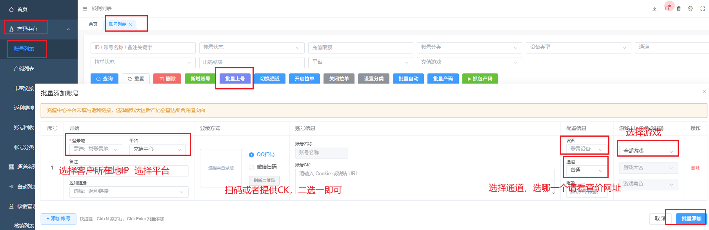
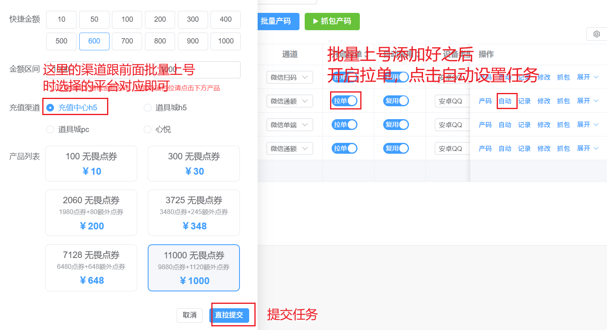

* 目录
{:toc}

## 登录

太简单了，我暂时也不知道有啥好说的

## 扫码

网页端登录上去 —— 产码中心 —— 账号列表 —— 批量上号

- 登录地：充值号的常登录城市
- 平台：你的充值平台，不知道的话一般就是充值中心
- 登录方式/账号CK：可以选择扫码登录，也可以选择放CK链接来登录。温馨提示，一号多挂的话扫码容易掉CK
- 设备：充值账号设备，如果不区分苹果安卓的话（比如PC端的游戏），那就随便选
- 通道：不知道挂什么通道的看一下查价网站。需要注意的是：王者安卓微信禁止挂微信端通道
- 游戏：选择你要充值的游戏类型，Q币也要选，别漏了

## 自动

在账号添加上来后，需要设置下限笔限额以及自动任务。自动任务的话注意下这个充值渠道请跟前面扫码时选择的平台要对应

## 软件

由于星悦的取码逻辑跟小刀、GBO等不太一样，为了方便大家拉码故提供 星悦智能任务 脚本与软件，由于之前我的诸多脚本都被盗用，故此次外放只提供软件版本。软件采用授权机制，目前只对我名下核销以及部分其他人给予权限开放。

[星悦智能任务v1.2.exe](https://luei.lanzouq.com/iwnrC3jfss0j)
